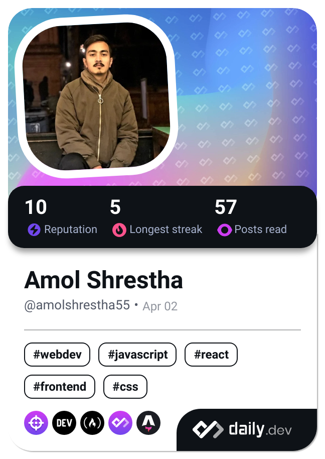

### Hi there 👋

#### I am a Senior Frontend Developer with over 6 years of experience specializing in building responsive, user-centric web applications. 
#### I am skilled in HTML5, CSS3, JavaScript (ES6+), and modern libraries and frameworks like React.js, Astro, and Angular. Passionate about improving user experience and pushing the boundaries of web performance.

<!--
**AmolShrestha/AmolShrestha** is a ✨ _special_ ✨ repository because its `README.md` (this file) appears on your GitHub profile.

Here are some ideas to get you started:

- 🔭 I’m currently working on ...
- 🌱 I’m currently learning ...
- 👯 I’m looking to collaborate on ...
- 🤔 I’m looking for help with ...
- 💬 Ask me about ...
- 📫 How to reach me: ...
- 😄 Pronouns: ...
- ⚡ Fun fact: ...
-->

